\newpage

# Propuesta de Solución para la Plataforma de Servicios

## Problemas a Resolver

1. **Falta de confianza en los proveedores:** Los clientes desconfían de la calidad y seguridad de los servicios ofrecidos.
2. **Dificultad para encontrar servicios confiables:** El mercado está fragmentado y es difícil localizar profesionales confiables.
3. **Gestión ineficiente de citas y horarios:** La coordinación y programación de servicios es ineficiente, lo que puede llevar a cancelaciones o demoras.
4. **Falta de transparencia en precios y servicios:** Los clientes desconocen los costos y detalles específicos de los servicios.
5. **Falta de feedback y reseñas:** Los usuarios no tienen suficiente información sobre experiencias previas con los proveedores.
6. **Proceso de pago inseguro o complicado:** La falta de un sistema de pago seguro y conveniente puede desalentar a los clientes.

<!-- //## Dudas sobre el Dominio -->
<!-- 1. ¿Qué regulación o licencias se requieren para los proveedores de servicios en diferentes áreas geográficas? -->
<!-- 2. ¿Qué tipo de seguro o garantía deben ofrecer los proveedores de servicios? -->
<!-- 3. ¿Cuáles son las expectativas de los clientes en términos de tiempo de respuesta y disponibilidad? -->
<!-- 4. ¿Qué nivel de verificación de antecedentes es necesario para los proveedores? -->
<!-- 5. ¿Qué plataformas similares existen y qué servicios ofrecen? -->

## Orientación de la Solución

1. **Desarrollo de una plataforma confiable:** Crear una aplicación o sitio web donde los proveedores de servicios puedan registrarse y los clientes puedan encontrar y contratar servicios fácilmente.
2. **Verificación y certificación:** Implementar un sistema de verificación y certificación para asegurar calidad y confianza en los proveedores.
3. **Sistema de reseñas y calificaciones:** Permitir a los usuarios dejar reseñas y calificaciones para fomentar la transparencia.
4. **Integración de pagos seguros:** Ofrecer opciones de pago seguras y diversas para facilitar las transacciones.
5. **Gestión de citas:** Incluir funciones para agendar, y recordar citas.

## Alcance de la Solución

1. **Usuarios:** Hogares y residentes en busca de servicios de mantenimiento y reparaciones.
2. **Proveedores:** Profesionales y empresas ofreciendo servicios de jardinería, plomería, limpieza, etc.
3. **Geografía:** Iniciar en una ciudad o región específica con planes de expansión.
4. **Plataformas:** Aplicación web.

# Requerimientos

## Funcionales

### Sistema de búsqueda

Motor de búsqueda para encontrar servicios específicos basados en nombre y
calificaciones.

### Sistema de reservas

Herramienta para agendar y cancelar servicios.

### Sistema de pagos

Integración de múltiples opciones de pago seguro (tarjetas de crédito, transferencias
bancarias, etc.).

### Reseñas 

Funcionalidad para que los usuarios puedan dejar su opinión acerca de un servicio.

### Calificación Rápida

Permite a los usuarios calificar un servicio rápidamente después de completarlo sin
necesidad de escribir una reseña completa.

### Soporte al cliente 

Canal de soporte para resolver problemas o consultas tanto de usuarios como de
proveedores.

### Verificación y certificación

Proceso para verificar certificaciones de los proveedores.

### Confirmación de Citas por Correo Electrónico

Enviar correos electrónicos de confirmación para nuevas citas, modificaciones y
cancelaciones.

### Campo de Notas

Añadir un campo de notas en las reservas para que los usuarios puedan agregar
información adicional o instrucciones para el proveedor.

## No Funcionales

### Rendimiento

El sistema manejará un alto volumen de citas y transacciones simultáneas sin tiempos
de respuesta que sobrepasen 5 segundos. Las páginas cargarán en menos de 2 segundos
bajo carga normal y menos de 5 segundos bajo carga máxima. Se implementarán pruebas
de carga y estrés cada mes para asegurar el cumplimiento de estos requisitos.

### Disponibilidad

El sistema estará disponible durante las horas de operación del salón de belleza (7
días a la semana, de 9:00 AM a 9:00 PM). El tiempo de inactividad planificado para
mantenimiento y actualizaciones no excederá las 4 horas mensuales y será programado
fuera de las horas de operación.

### Seguridad

Se implementarán medidas de seguridad para proteger los datos confidenciales de los
clientes y del negocio, específicamente cifrado de datos en tránsito y en reposo,
autenticación basada en usuario y contraseña.

### Escalabilidad

El sistema crecerá y se adaptará fácilmente a medida que el negocio del salón de
belleza se expanda, sin comprometer el rendimiento o la funcionalidad. Se utilizarán
bases de datos distribuidas para lograrlo.

### Compatibilidad

El sistema será compatible con Chrome(V125.0), Firefox(V80.2) y Safari(V9.5).

### Mantenibilidad

Se hará código limpio[@clean-code] y bien documentado que permitirá a los desarrolladores realizar
cambios sin problemas. Esto incluirá la implementación de estándares de codificación,
revisiones de código y documentación detallada.

# Casos de Uso

## Búsqueda de Servicios

- Resumen: Permitir a los usuarios encontrar servicios específicos basados en
ubicación, tipo de servicio y calificaciones.
- Actores: Usuario
- Nivel: Usuario
- Disparador: El usuario desea encontrar un servicio específico.
- Precondiciones: El usuario debe estar registrado en la plataforma.

### Flujo Normal

1. El usuario accede a la plataforma y selecciona la opción de búsqueda.
1. El usuario ingresa los criterios de búsqueda (ubicación, tipo de servicio,
calificaciones).
1. El sistema muestra una lista de proveedores que coinciden con los criterios
ingresados.
1. El usuario revisa los resultados y selecciona un proveedor.

### Flujos Alternos y Excepciones

- Si no se encuentran proveedores que coincidan con los criterios, el sistema muestra
un mensaje informando al usuario y sugiere opciones cercanas o similares.

## Sistema de Reservas

- Resumen: Permitir a los usuarios agendar y cancelar citas con los proveedores.
- Actores: Usuario, Proveedor de servicios
- Nivel: Usuario
- Disparador: El usuario desea agendar una cita para un servicio.
- Precondiciones: El usuario debe haber encontrado un proveedor adecuado.

### Flujo Normal

1. El usuario selecciona un proveedor y solicita una cita.
1. El sistema muestra la disponibilidad del proveedor.
1. El usuario elige una fecha y hora disponibles y confirma la cita.
1. El proveedor recibe una notificación de la nueva cita.
1. El usuario puede cancelar la cita desde su perfil.

### Flujos Alternos y Excepciones

- Si el proveedor no está disponible en la fecha/hora seleccionada, el sistema avisa.
- Si el usuario cancela una cita, el sistema avisa.

## Sistema de Pagos

- Resumen: Permitir a los usuarios realizar pagos a través de la plataforma.
- Actores: Usuario
- Nivel: Usuario
- Disparador: El usuario desea pagar por un servicio contratado.
- Precondiciones: El usuario debe haber confirmado una cita con un proveedor.

### Flujo Normal

1. El usuario elige el método de pago (tarjeta de crédito o débito).
1. El usuario ingresa los detalles de pago y confirma la transacción.
1. El sistema procesa el pago, notifica al usuario y al proveedor.

### Flujos Alternos y Excepciones

- Si el pago es rechazado, el sistema informa al usuario y permite intentar nuevamente
con un método diferente.

## Dejar Reseña y Calificación

- Resumen: Permitir a los usuarios dejar comentarios y calificaciones sobre los servicios recibidos.
- Actores: Usuario
- Nivel: Usuario
- Disparador: El usuario desea dejar una reseña después de recibir un servicio.
- Precondiciones: El usuario debe haber completado una cita con un proveedor.

### Flujo Normal

1. El usuario accede a la sección de historial de servicios.
1. El usuario selecciona el servicio para el que desea dejar una reseña.
1. El usuario ingresa un comentario y una calificación y la envía.
1. El sistema actualiza el perfil del proveedor con la nueva reseña y calificación.

### Flujos Alternos y Excepciones

- Si el usuario no ha recibido el servicio, no puede dejar una reseña.

## Soporte al Cliente

- Resumen: Permitir a los usuarios y proveedores resolver problemas o consultas a través del soporte al cliente.
- Actores: Usuario, Proveedor de servicios, Agente de soporte
- Nivel: Usuario
- Disparador: El usuario o proveedor tiene una consulta o problema.
- Precondiciones: El usuario o proveedor debe estar registrado en la plataforma.

### Flujo Normal

1. El usuario/proveedor accede a la sección de soporte al cliente.
1. El usuario/proveedor selecciona el tipo de consulta o problema.
1. El usuario/proveedor describe el problema y envía la solicitud.
1. Un agente de soporte recibe la solicitud y se comunica con el usuario/proveedor.
1. El agente de soporte resuelve el problema o responde la consulta.

### Flujos Alternos y Excepciones

- Si el problema no se resuelve en la primera interacción, el agente de soporte sigue
  trabajando con el usuario/proveedor hasta encontrar una solución.

## Verificación y Certificación de Proveedores

- Resumen: Verificar las certificaciones y antecedentes de los proveedores antes de permitirles ofrecer servicios en la plataforma.
- Actores: Proveedor de servicios, Administrador de la plataforma
- Nivel: Usuario
- Disparador: Un proveedor se registra en la plataforma y desea ofrecer sus servicios.
- Precondiciones: El proveedor debe haber completado el proceso de registro.

### Flujo Normal

1. El proveedor envía sus certificaciones y antecedentes para verificación.
1. El administrador de la plataforma revisa los documentos y realiza las verificaciones necesarias.
1. El administrador aprueba o rechaza al proveedor basado en la verificación.
1. Si es aprobado, el proveedor puede comenzar a ofrecer servicios en la plataforma.

### Flujos Alternos y Excepciones

- Si el proveedor es rechazado, el sistema informa al proveedor con las razones y
  posibles acciones para corregir la situación.

## Registro de Proveedor

- Resumen: Permitir a los proveedores de servicios registrarse en la plataforma proporcionando sus datos personales, certificaciones y detalles del servicio que ofrecen.
- Actores: Proveedor de servicios
- Nivel: Usuario
- Disparador: Un proveedor desea ofrecer sus servicios a través de la plataforma.
- Precondiciones: El proveedor debe tener acceso a internet y a los documentos necesarios para el registro.

### Flujo Normal

1. El proveedor accede a la plataforma y selecciona la opción de registro.
1. El proveedor ingresa sus datos personales, certificaciones y detalles del servicio ofrecido.
1. El proveedor envía la información para verificación.
1. El sistema notifica al proveedor que su registro está en proceso de verificación.

### Flujos Alternos y Excepciones

- Si el proveedor no completa todos los campos requeridos, el sistema muestra un
  mensaje de error indicando los campos faltantes.

## Creación y Edición de Perfil de Proveedor

- Resumen: Permitir a los proveedores crear y editar su perfil, incluyendo fotos, descripciones, precios y disponibilidad.
- Actores: Proveedor de servicios
- Nivel: Usuario
- Disparador: Un proveedor desea actualizar su información en la plataforma.
- Precondiciones: El proveedor debe estar registrado y verificado en la plataforma.

### Flujo Normal

1. El proveedor accede a su cuenta y selecciona la opción para editar el perfil.
1. El proveedor actualiza sus fotos, descripciones, precios y disponibilidad.
1. El proveedor guarda los cambios.
1. El sistema actualiza el perfil del proveedor con la nueva información.

### Flujos Alternos y Excepciones

- Si el proveedor intenta ingresar información inválida (e.g., precios negativos), el
  sistema muestra un mensaje de error y no guarda los cambios.

## Confirmación de Servicio

- Resumen: Permitir a los proveedores revisar y confirmar las solicitudes de servicio de los usuarios.
- Actores: Proveedor de servicios, Usuario
- Nivel: Usuario
- Disparador: Un usuario solicita un servicio.
- Precondiciones: El usuario debe haber solicitado un servicio y el proveedor debe tener la capacidad de confirmar servicios.

### Flujo Normal

1. El proveedor recibe una notificación de una nueva solicitud de servicio.
1. El proveedor revisa los detalles de la solicitud (fecha, hora, tipo de servicio).
1. El proveedor confirma la solicitud de servicio.
1. El sistema notifica al usuario que su solicitud ha sido confirmada.

### Flujos Alternos y Excepciones

- Si el proveedor no está disponible en la fecha/hora solicitada, se mostrara una
  alerta al usuario

## Visualización de Historial de Servicios

- Resumen: Permitir a los usuarios revisar el historial de los servicios contratados
- Actores: Usuario
- Nivel: Usuario
- Disparador: El usuario desea revisar sus servicios anteriores.
- Precondiciones: El usuario debe haber contratado al menos un servicio a través de la plataforma.

### Flujo Normal

1. El usuario accede a su perfil y selecciona la opción de historial de servicios.
1. El sistema muestra una lista de los servicios contratados por el usuario, incluyendo fechas, proveedores, y calificaciones.
1. El usuario selecciona un servicio específico para ver más detalles.
1. El sistema muestra los detalles completos del servicio seleccionado.

### Flujos Alternos y Excepciones

- Si el usuario no ha contratado ningún servicio, el sistema muestra un mensaje
  indicando que no hay servicios en el historial.

## Adición de Notas en Reservas

- Resumen: Permitir a los usuarios agregar información adicional o instrucciones para el proveedor en una reserva.
- Actores: Usuario, Proveedor de Servicios
- Nivel: Usuario
- Disparador: El usuario desea proporcionar instrucciones específicas o información adicional al proveedor al realizar una reserva.
- Precondiciones: El usuario debe estar registrado en la plataforma y haber seleccionado un proveedor para realizar una reserva.

### Flujo Normal

1. El usuario busca y selecciona un servicio en la plataforma.
1. El usuario elige un proveedor y procede a realizar una reserva.
1. Durante el proceso de reserva, el usuario encuentra un campo designado para agregar notas adicionales.
1. El usuario ingresa la información adicional o instrucciones específicas para el proveedor en el campo de notas.
1. El usuario confirma la reserva.
1. El sistema registra la reserva junto con las notas adicionales proporcionadas por el usuario.
1. El proveedor recibe la reserva junto con las notas adicionales asociadas.

### Flujos Alternos y Excepciones

- Si el usuario no desea agregar notas adicionales, puede continuar con el proceso de
  reserva sin completar el campo de notas.

\newpage

# Historias de Usuario

## 1. Búsqueda de Servicios

**Descripción:** Como usuario, quiero buscar servicios de hogar en la plataforma para
revisar opciones disponibles, leer reseñas y comparar precios antes de agendar una
cita.

**Criterios de Aceptación:**

- El usuario puede ingresar palabras clave para buscar servicios.
- Los resultados de búsqueda muestran nombres de servicios, descripciones, precios y calificaciones.
- El usuario puede filtrar resultados por ubicación, tipo de servicio y calificaciones.
- La búsqueda debe ser rápida[^manera-rapida] y mostrar resultados relevantes.

**Puntos:** 8

## 2. Contratación de Servicios

**Descripción:** Como usuario, quiero contratar un servicio de hogar para agendar una cita de manera fácil y conveniente.

**Criterios de Aceptación:**

- El usuario puede seleccionar un servicio de la lista de búsqueda.
- El usuario puede ver la disponibilidad del proveedor y elegir una fecha y hora.
- La plataforma confirma la cita y envía notificaciones al usuario y al proveedor.

**Puntos:** 5

## 3. Gestión de Citas

**Descripción:** Como proveedor, quiero revisar citas programadas, cambios o cancelaciones para gestionar mejor mi agenda.

**Criterios de Aceptación:**

- El proveedor puede ver una lista de sus citas programadas.
- El proveedor recibe notificaciones de nuevas citas, cambios o cancelaciones.
- El proveedor puede aceptar o rechazar cambios en las citas.

**Puntos:** 8

## 4. Pago Seguro

**Descripción:** Como cliente, quiero realizar el pago de un servicio de plomería a través de la plataforma utilizando un método seguro.

**Criterios de Aceptación:**

- El cliente puede elegir entre múltiples métodos de pago (tarjeta de crédito, débito, PayPal).
- La plataforma debe garantizar la seguridad de las transacciones.
- El cliente recibe una confirmación de pago exitosa.

**Puntos:** 5

## 5. Dejar una Reseña

**Descripción:** Como cliente, quiero dejar una reseña y calificación después de recibir un servicio de limpieza para compartir mi experiencia.

**Criterios de Aceptación:**

- El cliente puede escribir un comentario y dar una calificación en una escala de 1 a 5 estrellas.
- Las reseñas son visibles para otros usuarios y proveedores.
- El cliente puede editar o eliminar su reseña.

**Puntos:** 3

## 6. Búsqueda Avanzada

**Descripción:** Como usuario, quiero utilizar un motor de búsqueda avanzado para encontrar servicios específicos basados en nombre del servicio y calificaciones.

**Criterios de Aceptación:**

- El usuario puede aplicar múltiples filtros en la búsqueda.
- Los resultados de la búsqueda se obtienen de manera rápida[^manera-rapida].
- La búsqueda avanzada permite guardar filtros para futuras búsquedas.

[^manera-rapida]: Menor a 2 segundos.

**Puntos:** 8

## 7. Sistema de Reservas

**Descripción:** Como usuario, quiero agendar y cancelar servicios.

**Criterios de Aceptación:**

- El usuario puede ver un calendario con sus servicios programados.
- El usuario puede cancelar servicios con confirmación del proveedor.
- El usuario recibe notificaciones de confirmación de cambios o cancelaciones.

**Puntos:** 8

## 8. Sistema de Pagos

**Descripción:** Como usuario, quiero tener múltiples opciones de pago seguro para elegir el método de pago que mejor me convenga.

**Criterios de Aceptación:**

- El sistema soporta tarjetas de crédito, débito y otros métodos de pago electrónicos.
- Las transacciones son seguras y encriptadas.
- El usuario puede guardar información de pago para futuras transacciones.

**Puntos:** 5

## 9. Reseñas y Calificaciones

**Descripción:** Como usuario, quiero dejar comentarios y calificaciones para compartir mi experiencia y ayudar a otros usuarios en sus decisiones.

**Criterios de Aceptación:**

- El usuario puede dejar comentarios y calificaciones después de recibir un servicio.
- Las reseñas y calificaciones son visibles para todos los usuarios de la plataforma.
- El usuario puede editar o eliminar sus comentarios y calificaciones.

**Puntos:** 3

## 10. Soporte al Cliente

**Descripción:** Como usuario/proveedor, quiero tener acceso a un canal de soporte para resolver problemas o consultas de manera rápida y efectiva.

**Criterios de Aceptación:**

- La plataforma ofrece un chat en vivo, correo electrónico y soporte telefónico.
- Las consultas son respondidas dentro de un tiempo razonable.
- El usuario/proveedor puede ver el historial de sus consultas y respuestas.

**Puntos:** 5

## 11. Verificación y Certificación

**Descripción:** Como administrador de la plataforma, quiero verificar certificaciones de los proveedores para asegurarme de que los servicios ofrecidos sean de calidad y confiables.

**Criterios de Aceptación:**

- Los proveedores pueden subir documentos de certificación para verificación.
- El administrador revisa y aprueba o rechaza las certificaciones.
- Los proveedores certificados son marcados como "Verificados" en la plataforma.

**Puntos:** 8

## 12. Confirmación de Citas por Correo Electrónico

**Descripción:** Como usuario, quiero recibir correos electrónicos de confirmación para nuevos servicios, modificaciones y cancelaciones.

**Criterios de Aceptación:**

- El sistema envía automáticamente un correo electrónico de confirmación al usuario cuando agende una nueva cita.
- Se envía un correo electrónico al usuario cuando se realicen modificaciones o cancelaciones en una cita existente.
- El correo electrónico de confirmación incluye detalles de la cita, como la fecha, hora y tipo de servicio.

**Puntos:** 5

## 13. Campo de Notas en Reservas

**Descripción:** Como usuario, quiero tener la capacidad de agregar notas adicionales o instrucciones específicas al proveedor al realizar una reserva.

**Criterios de Aceptación:**

- Durante el proceso de reserva, se proporciona un campo de texto donde el usuario puede ingresar notas o instrucciones para el proveedor.
- Las notas ingresadas por el usuario se guardan junto con los detalles de la reserva y son visibles para el proveedor.
- El proveedor puede acceder a las notas durante la cita para cumplir con las instrucciones proporcionadas por el usuario.

**Puntos:** 5

# Backlog

1. **Motor de búsqueda avanzado:** Implementar un motor de búsqueda avanzado que permita a los usuarios encontrar servicios específicos basados en ubicación, tipo de servicio y calificaciones.
2. **Sistema de reservas:** Desarrollar una herramienta para agendar y cancelar citas.
3. **Sistema de pagos:** Integrar múltiples opciones de pago seguro, incluyendo tarjetas de crédito, transferencias bancarias y otros métodos de pago electrónicos.
4. **Funcionalidad de reseñas y calificaciones:** Permitir a los usuarios dejar comentarios y calificaciones sobre los servicios recibidos.
5. **Soporte al cliente:** Implementar un canal de soporte para resolver problemas o consultas tanto de usuarios como de proveedores.
6. **Verificación y certificación de proveedores:** Establecer un proceso para verificar certificaciones de los proveedores.
7. **Confirmación de Citas por Correo Electrónico:** Enviar correos electrónicos de confirmación para nuevas citas, modificaciones y cancelaciones.
8. **Campo de Notas en Reservas:** Añadir un campo de notas en las reservas para que los usuarios puedan agregar información adicional o instrucciones para el proveedor.
9. **Calificación Rápida:** Permitir a los usuarios calificar un servicio rápidamente después de completarlo sin necesidad de escribir una reseña completa.

\newpage

# Matriz de Trazabilidad

| ID  | Requerimiento                    | Backlog                                      | Historias de Usuario |
| --- | -------------------------------- | -------------------------------------------- | -------------------- |
| R1  | Búsqueda avanzada                | Motor de búsqueda avanzado                   | H1, H6               |
| R2  | Sistema de reservas              | Sistema de reservas                          | H2, H3, H7           |
| R3  | Sistema de pagos                 | Sistema de pagos                             | H4, H8               |
| R4  | Reseñas                          | Funcionalidad de reseñas y calificaciones    | H5, H9               |
| R5  | Soporte al cliente               | Canal de soporte                             | H10                  |
| R6  | Verificación y certificación     | Verificación y certificación de proveedores  | H11                  |
| R7  | Confirmación de Citas por Correo | Confirmación de Citas por Correo Electrónico | H12                  |
| R8  | Campo de Notas en Reservas       | Campo de Notas en Reservas                   | H13                  |
| R9  | Calificación Rápida              | Calificación Rápida                          | H5, H9               |

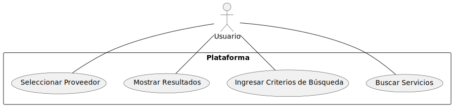

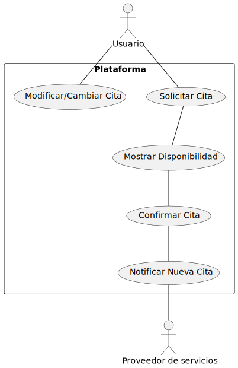

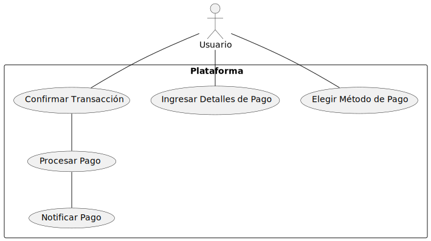

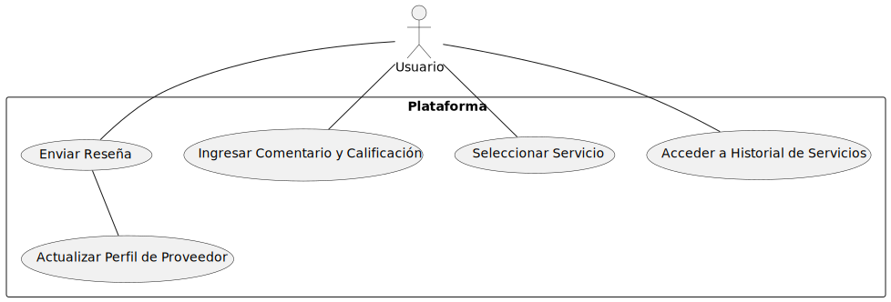

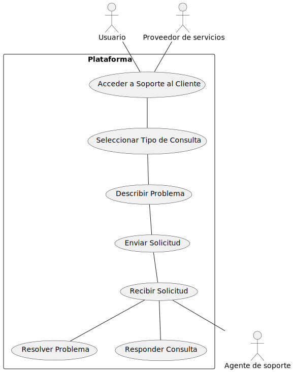

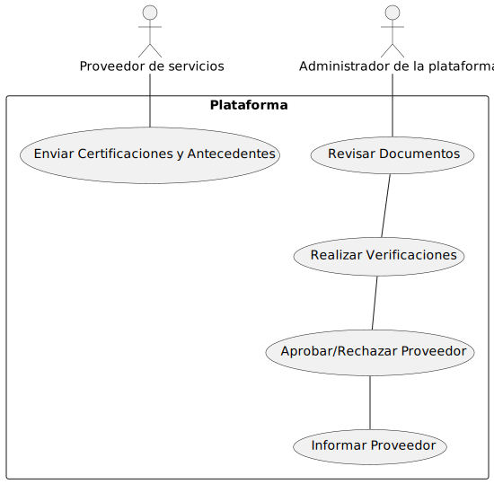

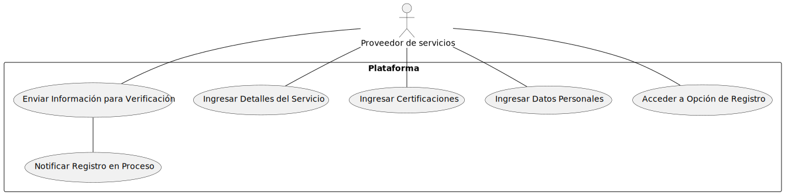

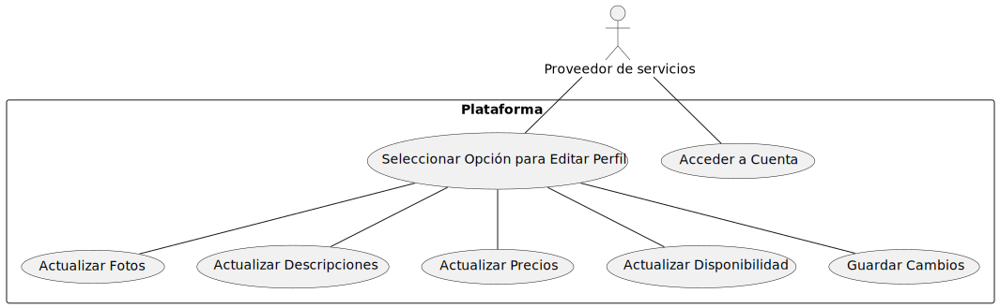

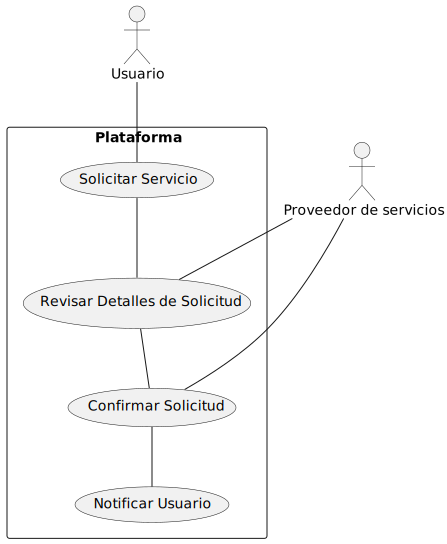

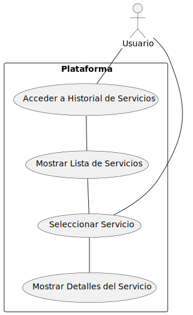

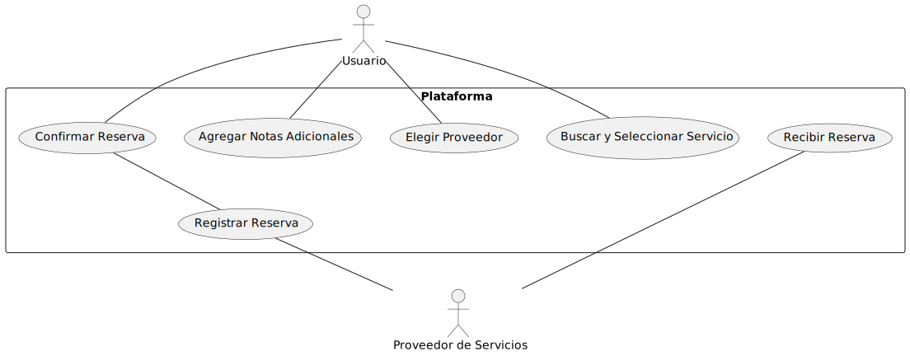

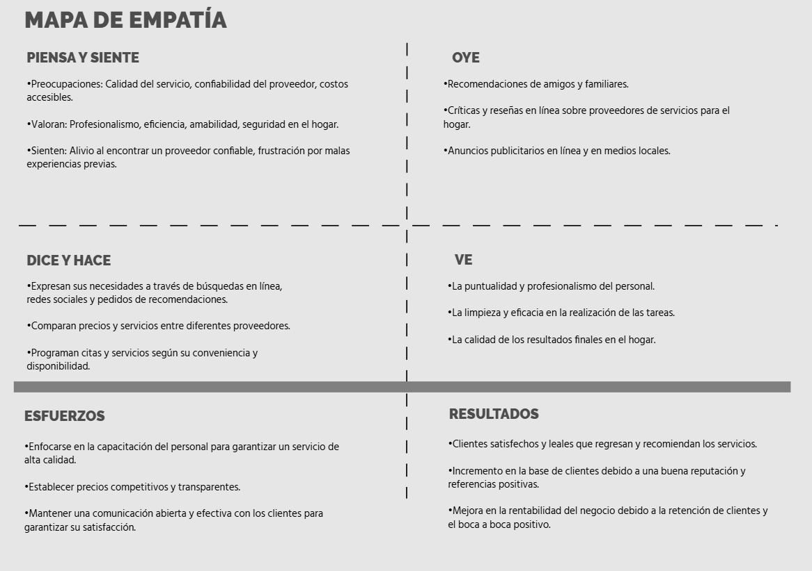

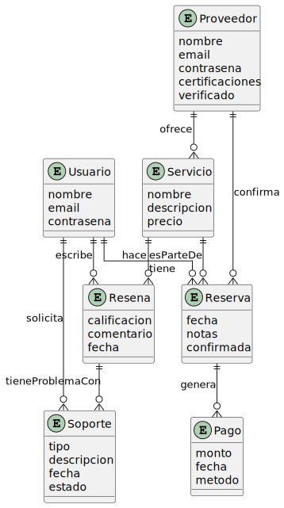

\newpage

# Bibliografía

---
